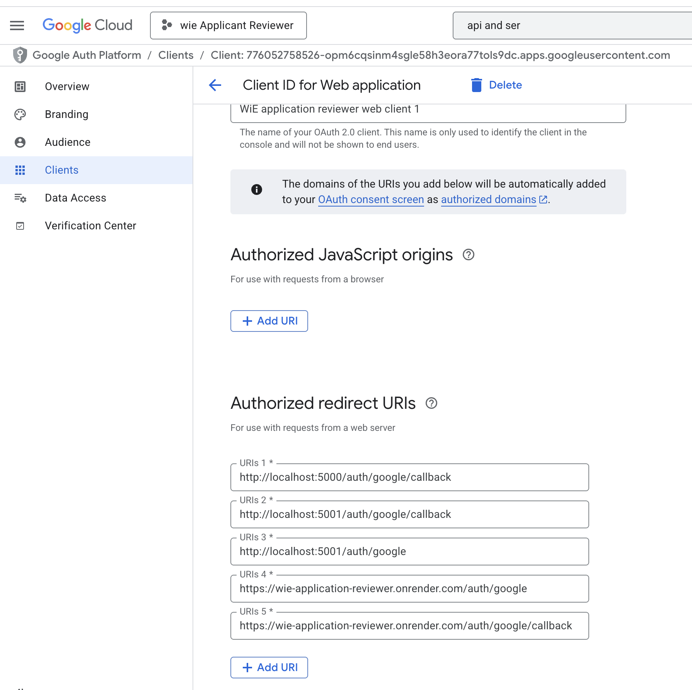

# WiE Undergrad Website

A React web application that allows club administrators to review applicants from Google Sheets, with the ability to vote on candidates and track voting results.

## Prerequisites

Before running this application, you'll need:

1. **Node.js** (version 16 or higher)

## Setup Instructions

### 1. Clone and Install Dependencies

```bash
fork the repository
cd applicant_reviewer
npm run install-all
```
run the backend with: 
```
node server/index.js
```
run the frontend with:
```
npm start
```

### Environment Variables
This project has 2 .env files you need to fill in. One in the root directory (/env.example) and one in the client directiry (/client/env.example)

### Deployment
We use https://dashboard.render.com/ to host the server and frontend. Our account is with wie@engsoc.uwaterloo.ca.

Frontend: 
- https://wie-undergrad-comm.onrender.com/
- [Onrender dashboard](https://dashboard.render.com/static/srv-d2pm02v5r7bs739sfn10/deploys/dep-d2prkjqdbo4c73foirr0?r=2025-08-31%4002%3A57%3A24%7E2025-08-31%4003%3A00%3A09)

Backend: 
- [Onrender dashboard](https://dashboard.render.com/web/srv-d2p5n1vdiees73bj95j0/settings)

# Detailed explination of how the google cloud project was setup (if you need this info)
Google cloud is needed for Google Auth and in order to access the Sheets spreadhseets. This was already set up once so you should only be reading this if something is broken with our google cloud platform. Our account uses the email wie@engsoc.uwaterloo.ca

#### A. Setup Google Cloud project
1. Go to [Google Cloud Console](https://console.cloud.google.com/)
2. Locate the [WiE Applicant Reviewer project](https://console.cloud.google.com/auth/clients/776052758526-opm6cqsinm4sgle58h3eora77tols9dc.apps.googleusercontent.com?project=wie-applicant-reviewer)
3. Enable the following APIs:
   - Google Sheets API
   - Google+ API (for OAuth)
4. 

#### B. Configure OAuth Consent Screen
1. Go to "APIs & Services" > "OAuth consent screen"
2. Choose "External" user type (unless you have a Google Workspace organization)
3. Fill in the required information:
   - **App name**: "Applicant Reviewer" (or your preferred name)
   - **User support email**: Your email address
   - **Developer contact information**: Your email address
4. Click "Save and Continue"
5. On "Scopes" page, click "Save and Continue"
6. On "Test users" page, add your email address as a test user
7. Click "Save and Continue"
8. Review and click "Back to Dashboard"

#### C. Create OAuth 2.0 Credentials
1. Go to "APIs & Services" > "Credentials"
2. Click "Create Credentials" > "OAuth client ID"
3. Choose "Web application" as application type
4. Add authorized redirect URIs:
   - `http://localhost:5001/auth/google/callback` (for development)
   - `https://yourdomain.com/auth/google/callback` (for production) - note our domain is https://wie-application-reviewer.onrender.com
5. Click "Create"
6. Note down your Client ID and Client Secret

#### D. Create Service Account
1. Go to "APIs & Services" > "Credentials"
2. Click "Create Credentials" > "Service Account"
3. Fill in the service account details:
   - **Service account name**: "applicant-reviewer-sheets" (or your preferred name)
   - **Service account ID**: Will auto-generate
   - **Description**: "Service account for accessing Google Sheets in Applicant Reviewer app"
4. Click "Create and Continue"
5. **Permissions (optional)**: Click "Select a role"
   - Search for and select: **"Google Sheets API > Sheets API > Sheets API Reader"**
   - This gives read-only access to Google Sheets
6. Click "Continue"
7. **Principals with access (optional)**: Leave this blank - no additional users need access
8. Click "Done"
9. Click on your newly created service account
10. Go to "Keys" tab
11. Click "Add Key" > "Create new key"
12. Choose "JSON" format
13. Download the JSON key file
14. Note down the `client_email` and `private_key` from the JSON

**Important**: Update your Google Cloud Console OAuth settings to include your production domain in the authorized redirect URIs.

## Google Sheet Format Requirements

Your Google Sheet must have these columns:
- **Name**: Applicant's full name
- **First Choice Directorship**: The role they're applying for (this is used for grouping)
- **Email**: Applicant's email address
- **Any other columns**: Will be displayed but not used for grouping

Example structure:
```
| Timestamp | Name | Email | First Choice Directorship | Are you an undergraduate student? | Other Info |
|-----------|------|-------|---------------------------|-----------------------------------|------------|
| 2024-01-15 | John Doe | john@email.com | Marketing Director | Yes | Additional details |
| 2024-01-15 | Jane Smith | jane@email.com | Events Coordinator | No | More info |
```